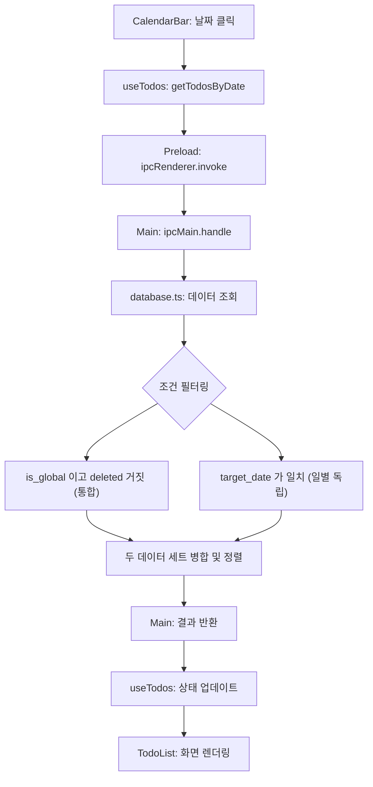
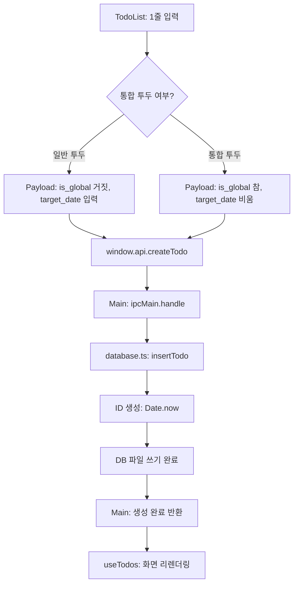
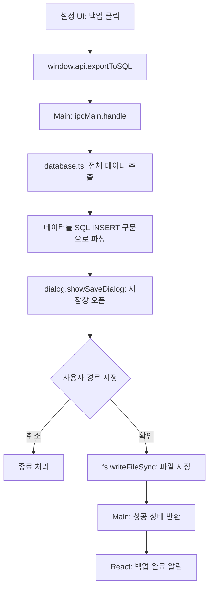

① 일별 투두 조회 및 데이터 병합 흐름

```mermaid
graph TD
    ClickDate["CalendarBar: 날짜 클릭"] --> CallHook["useTodos: getTodosByDate"]
    CallHook --> InvokeIPC["Preload: ipcRenderer.invoke"]
    InvokeIPC --> HandleIPC["Main: ipcMain.handle"]
    HandleIPC --> QueryDB["database.ts: 데이터 조회"]
    QueryDB --> FilterData{"조건 필터링"}
    FilterData --> Cond1["is_global 이고 deleted 거짓 (통합)"]
    FilterData --> Cond2["target_date 가 일치 (일별 독립)"]
    Cond1 --> MergeData["두 데이터 세트 병합 및 정렬"]
    Cond2 --> MergeData
    MergeData --> ReturnIPC["Main: 결과 반환"]
    ReturnIPC --> UpdateState["useTodos: 상태 업데이트"]
    UpdateState --> RenderUI["TodoList: 화면 렌더링"]
```

② 통합 및 일별 투두 생성 로직 (로직 재활용)

```mermaid
graph TD
InputTodo["TodoList: 1줄 입력"] --> CheckGlobal{"통합 투두 여부?"}
CheckGlobal -->|일반 투두| NormalPayload["Payload: is_global 거짓, target_date 입력"]
CheckGlobal -->|통합 투두| GlobalPayload["Payload: is_global 참, target_date 비움"]
NormalPayload --> CallCreate["window.api.createTodo"]
GlobalPayload --> CallCreate
CallCreate --> HandleCreate["Main: ipcMain.handle"]
HandleCreate --> InsertDB["database.ts: insertTodo"]
InsertDB --> GenID["ID 생성: Date.now"]
GenID --> WriteFile["DB 파일 쓰기 완료"]
WriteFile --> ReturnSuccess["Main: 생성 완료 반환"]
ReturnSuccess --> RefreshUI["useTodos: 화면 리렌더링"]
```

③ 데이터 외부 익스포트 (SQL 백업)

```mermaid
graph TD
ClickExport["설정 UI: 백업 클릭"] --> CallExport["window.api.exportToSQL"]
CallExport --> HandleExport["Main: ipcMain.handle"]
HandleExport --> FetchAll["database.ts: 전체 데이터 추출"]
FetchAll --> MakeSQL["데이터를 SQL INSERT 구문으로 파싱"]
MakeSQL --> OpenDialog["dialog.showSaveDialog: 저장창 오픈"]
OpenDialog --> UserAction{"사용자 경로 지정"}
UserAction -->|취소| Cancel["종료 처리"]
UserAction -->|확인| WriteSQL["fs.writeFileSync: 파일 저장"]
WriteSQL --> ReturnResult["Main: 성공 상태 반환"]
ReturnResult --> AlertUser["React: 백업 완료 알림"]
```
